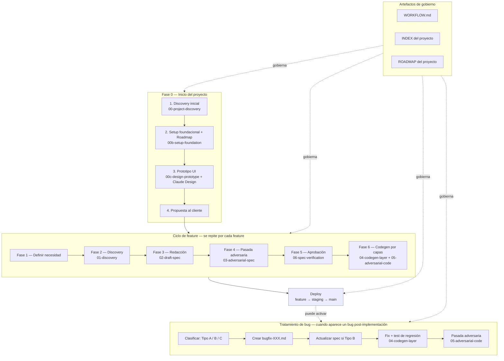

# Vista general del proceso SDD

> **Toolkit:** sdd-toolkit
> **Versión:** 20260526-v2
> **Propósito:** Vista rápida del proceso completo del toolkit SDD. Para detalle visual completo, ver [`process-diagram.svg`](./process-diagram.svg).

---

## Diagrama del proceso

---

## Lectura rápida

**Fase 0** se hace una sola vez por proyecto. Produce el setup foundacional, el roadmap y el prototipo UI.

**Ciclo de feature** se repite por cada feature listada en el roadmap. Tiene 6 fases secuenciales con prompts asociados.

**Deploy** ocurre después de completar Fase 6. Sigue el modelo de ramas definido en WORKFLOW sección 11.6.

**Artefactos de gobierno** son transversales: aplican a todo el proceso.

---

## Para detalle completo

El diagrama Mermaid de arriba muestra el esqueleto del proceso. Para ver el detalle visual completo con todos los artefactos, prompts, templates, inputs y outputs:

- [`process-diagram.svg`](./process-diagram.svg) — vista detallada con 21 artefactos del toolkit, colores por categoría, e información operativa por paso.

---

## Inventario del toolkit

El toolkit contiene **26 artefactos** organizados en:

- **1 workflow:** `WORKFLOW.md`
- **9 prompts:** 3 de Fase 0 + 6 del ciclo de feature
- **13 templates:** setup foundacional (6) + spec de feature (2) + proyecto (2) + ADR (1) + design system (1) + bugfix (1)
- **1 protocolo:** codegen-protocol
- **6 documentos:** process-overview, process-diagram.svg, 3 diagramas de flujo SVG, artifacts-usage-guide

Para listado completo y referencia rápida, ver `docs/artifacts-usage-guide.md`.

---

## Changelog

| Versión | Fecha | Cambios |
|---------|-------|---------|
| 20260523-v1 | 2026-05-23 | Versión inicial. |
| 20260526-v2 | 2026-05-26 | Agregado flujo de tratamiento de bugs al diagrama mermaid. Corregida referencia sección 9.6 → 11.6. Actualizado inventario: 23 → 26 artefactos con desglose correcto. |
